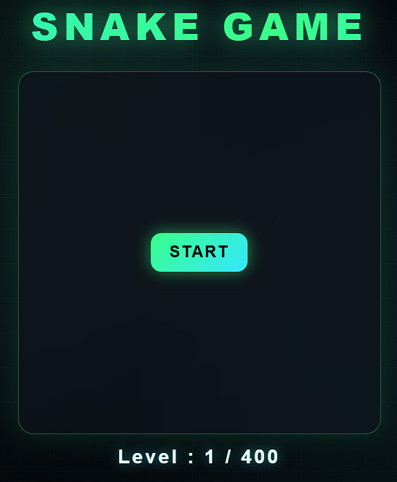
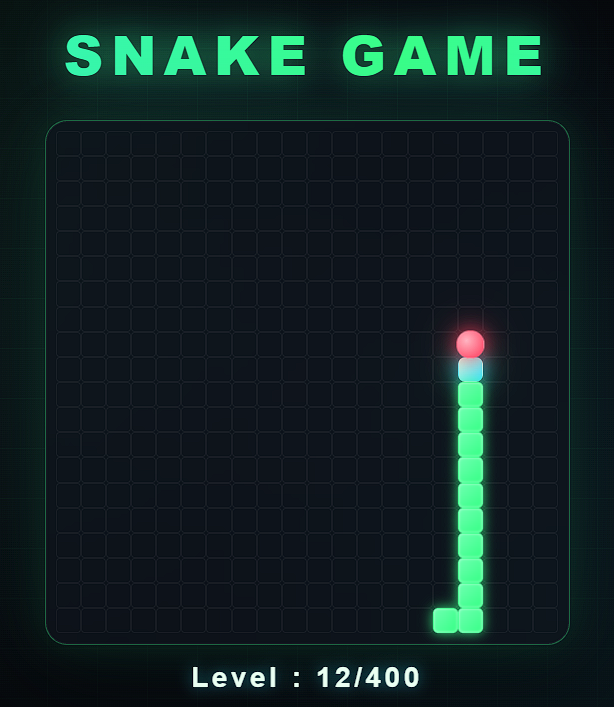
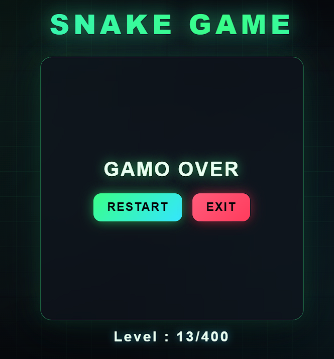

# SnakeGame

  
  

## ONLINE DEMO

#
A fully functional Snake game built with vanilla HTML, CSS, and JavaScript — no frameworks, no libraries. The whole game runs on a 20×20 grid mapped to a flat 1D index, using modulo arithmetic to detect grid edges and handle movement. Built to showcase my algorithmic and logical problem-solving mindset: translating a real-world problem into clean algorithmic logic, covering collision detection, dynamic growth, and win/lose states — all without any external state-management tools.

# SCREEN-SHOT

